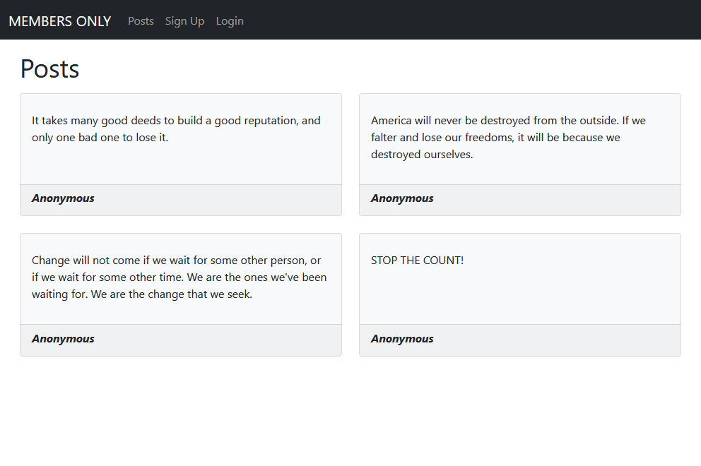
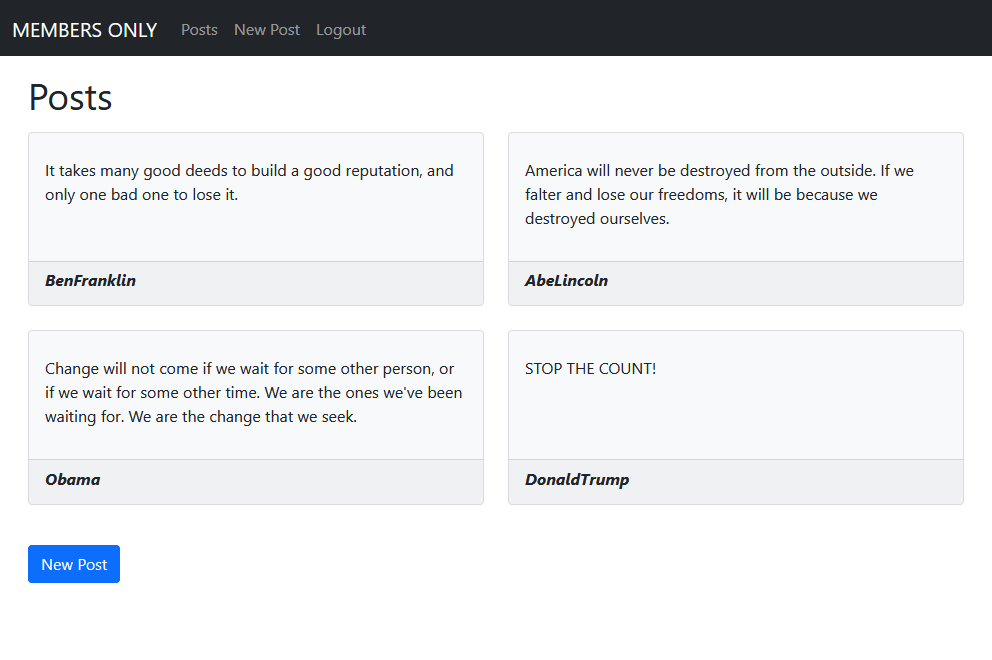

# Members Only

> Anonymous posts, unless you are a member.




This project makes use of the _Devise_ gem to implement basic user authentication. Only signed-in users can write new posts and see the author of other posts.

## Built With

- Ruby 3.0.0
- Ruby on Rails 6.1.1
- Devise

## Getting Started

To get a local copy up and running follow these steps:

### Setup

- Clone or download the project to your local machine

- Change to the project's root directory
```
cd members-only
```

- Install the required gems
```
bundle install
```

- Setup the database
```
rails db:migrate
```

- Start the server
```
rails server
```

- Access the application's web interface on your browser
```
http://localhost:3000/
```

## Author

👨‍💻 **Breno Xavier**

- GitHub: [@brenoxav](https://github.com/brenoxav)
- Twitter: [@brenoxav](https://twitter.com/brenoxav)
- LinkedIn: [Breno Xavier](https://linkedin.com/in/brenoxav)

## Show your support

Give a ⭐️ if you like this project!

## Acknowledgments

- Microverse
- Odin Project
